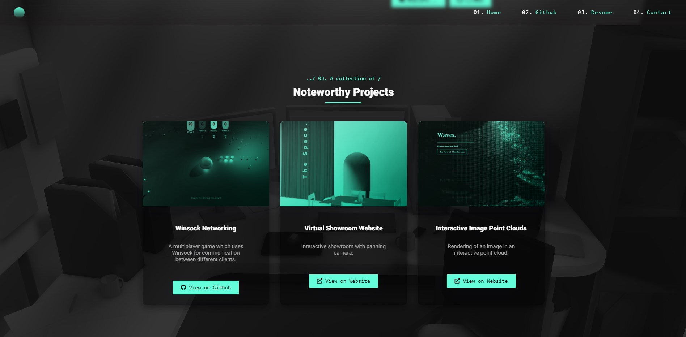

  

<h1 align="center">
  theonteo.com
</h1>

 V1 of Personal portfolio <a href="https://theonteo.com" target="_blank">theonteo.com</a> built with <a href="https://reactjs.org/" target="_blank">ReactJS</a> and hosted on <a href="https://www.netlify.com/" target="_blank">Netlify</a>

    

---

## Tech Stack
- React
- Html
- JavaScript
- CSS
## Libraries used
- Three.js

---

